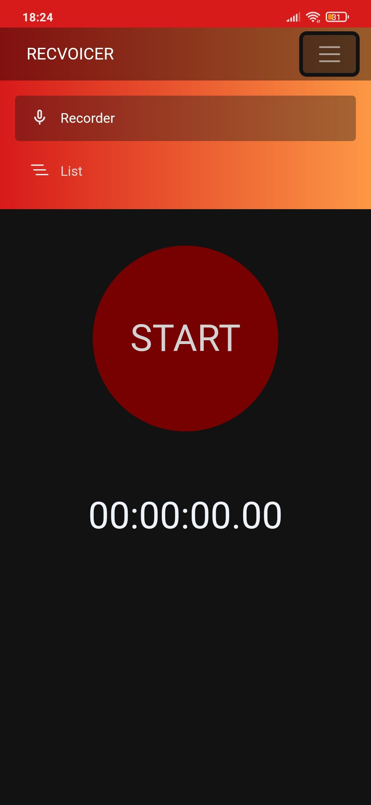
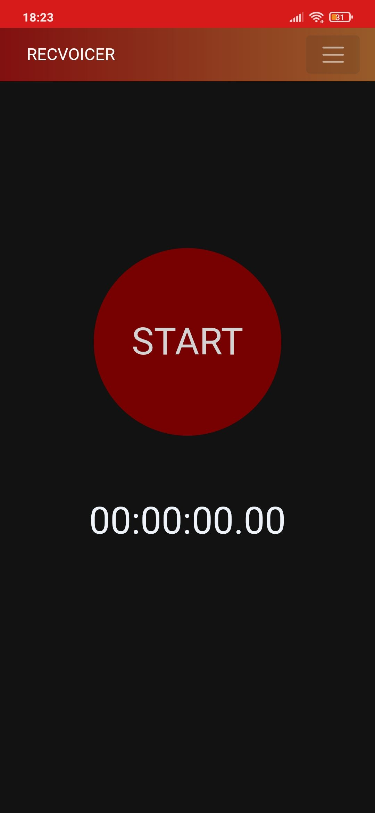
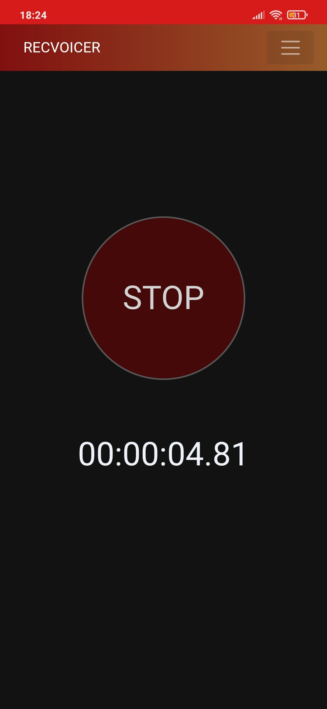
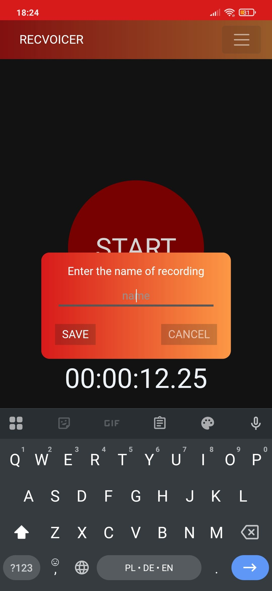
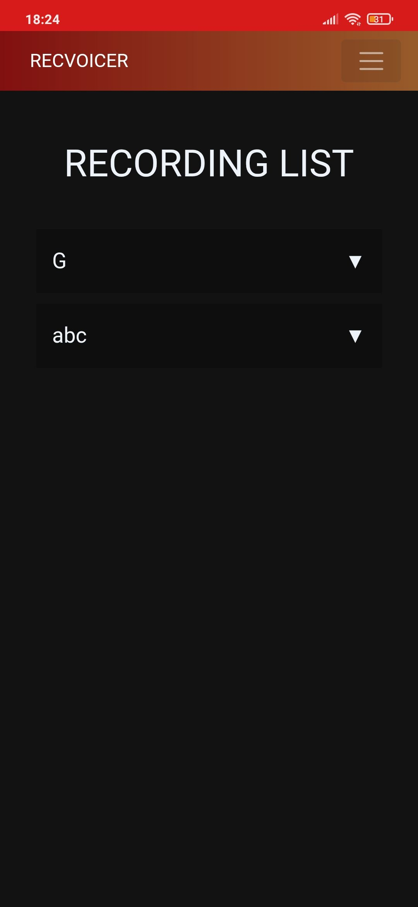
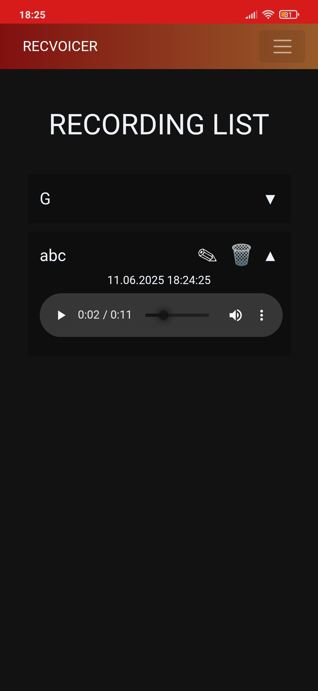

# recvoicer

## Table of Contents
- [Overview](#overview)
- [Features](#features)
- [Architecture](#architecture)
- [Installation](#installation)
- [Configuration](#configuration)
- [Usage](#usage)
  - [Use Cases](#use-cases)
- [Project Structure](#project-structure)
- [Dependencies](#dependencies)

---

## Overview

**recvoicer** is a cross-platform .NET MAUI application for recording, listing, editing, and removing audio recordings. It supports Android, iOS.

---

## Features

- Record audio and save to device storage
- List all saved recordings
- Play, edit, and remove recordings
- Responsive UI with dialogs for editing/removing
- Cross-platform support via .NET MAUI

---

## Architecture

- **Frontend:** .NET MAUI Blazor (Razor components)
- **Backend:** C# services for file and audio management
- **Storage:** Local device storage (per platform)
- **UI:** Razor pages and CSS for styling

---

## Installation

1. **Requirements:**
   - .NET 8 SDK
   - Visual Studio 2022+ with .NET MAUI workload

2. **Clone the repository:**
   
    ```git clone <your-repo-url> cd recvoicer```

3. **Restore dependencies:**

    ```dotnet restore```

---

## Configuration

- No special configuration is required.
- Platform-specific settings are managed in `recvoicer.csproj`.

---

## Usage

### Navigation


- **Recorder:** Record new audio and save it.
- **List:** View, play, edit, or remove existing recordings.

### Use Cases

#### 1. Record Audio



- Navigate to the Recorder page.
---


- Press the record button to start recording.
---


- After stopping, enter a name and save.

#### 2. List Recordings



- View all saved recordings.
---


- Select a recording to see details and actions.


#### 3. Play Recording


- Click the dropdown arrow next to a recording.
- Press play to listen.

#### 4. Edit Recording Name


- Click the edit icon (✎) next to a recording.
- Enter a new name and save.

#### 5. Remove Recording


- Click the remove icon (🗑) next to a recording.
- Confirm removal in the dialog.

---

## Project Structure

```
recvoicer/ 
├── Components/ 
│   └── Pages/ 
│       ├── List.razor
│       ├── Recorder.razor 
│       └── List.razor.css 
├── Services/ 
│   └── AudioService.cs 
├── Resources/ 
│   ├── AppIcon/ 
│   ├── Fonts/ 
│   ├── Images/ 
│   └── Splash/ 
├── recvoicer.csproj 
└── ...
```

---

## Dependencies

- `Microsoft.Maui.Controls`
- `Microsoft.Maui.Controls.Compatibility`
- `Microsoft.AspNetCore.Components.WebView.Maui`
- `Microsoft.Extensions.Logging.Debug`
- `Plugin.Maui.Audio`

---